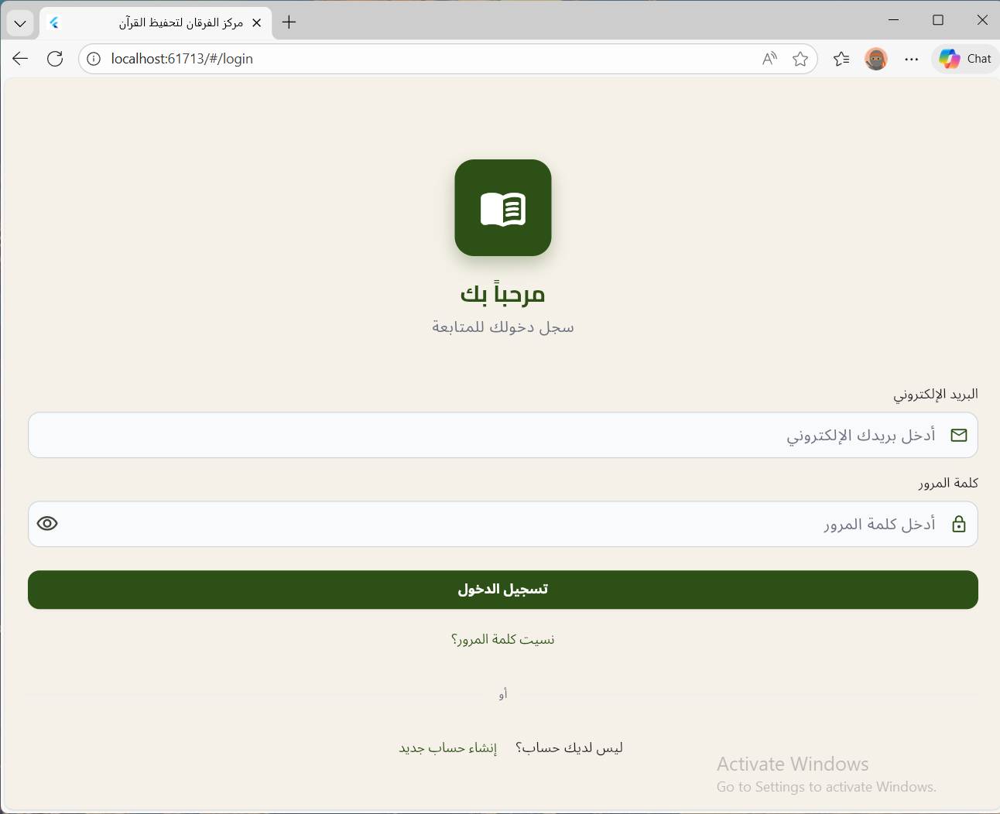
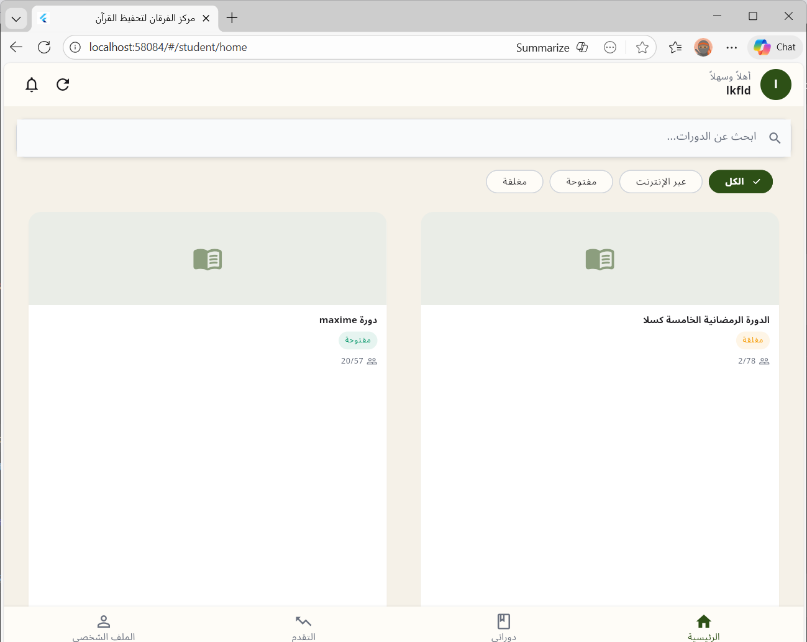
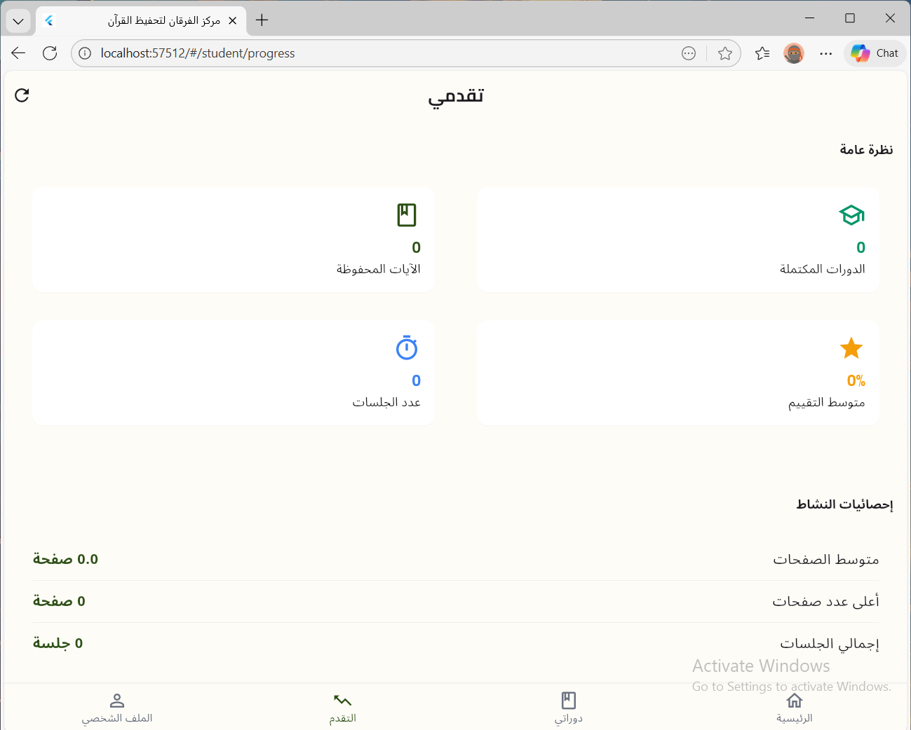

# Markaz Al-Furqan – Student Mobile Application

A modern **Flutter-based student application** designed to support Quran memorization at Markaz Al-Furqan. The app enables students to enroll in courses, record Hifz sessions, track memorization progress, and monitor performance through clear statistics and dashboards.

---

## ✨ Features

- 🔐 Secure authentication and profile management
- 📚 Course browsing and enrollment
- 🕌 Hifz session recording with evaluation tracking
- 📊 Real-time memorization progress and statistics
- 📱 Clean, responsive, and user-friendly Flutter UI
- 🔗 Seamless integration with the Markaz Al-Furqan backend API

---

## 🏗 Tech Stack

- **Flutter** (Dart)
- **Riverpod** for state management
- **REST API** integration
- **Material UI** with RTL support

---

## 🚀 Getting Started

### Prerequisites

- Flutter SDK installed
- Android Studio or VS Code
- Running Markaz Al-Furqan backend API

### Installation

```bash
git clone <repo-url>
cd student_app
flutter pub get
flutter run
```

---

## 📸 Screenshots





---

## 📦 Release

**Current Version:** `v1.0.0`
Initial public release including authentication, courses, Hifz tracking, and progress analytics.

---

## 📄 License

This project is developed for **Markaz Al-Furqan** educational purposes.

---

## 👤 Author

**Sideeg Mohammed Mirghani Mohammed Noor**
Software Engineer | Backend & Flutter Developer
